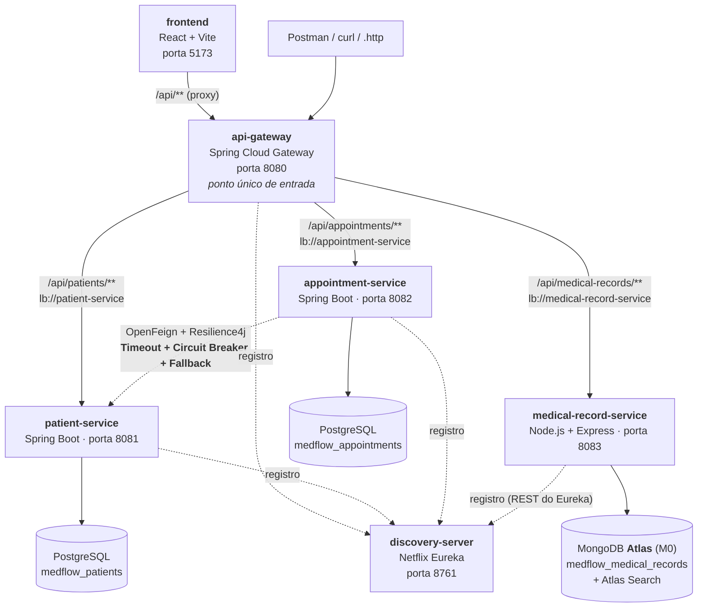

# MedFlow - Plataforma de Gestão Clínica Distribuída

Trabalho Prático - Arquitetura de Microservices e DevOps

- **Entrega 1:** proposta e arquitetura inicial (3 microservices, Eureka, Gateway, resiliência).
- **Entrega 2 (esta versão):** front-end React, prontuário eletrônico reescrito em **Node.js** sobre o
  **MongoDB Atlas**, com carga de 120 pacientes e uma demonstração guiada das capacidades do Atlas
  (schema flexível, aggregation pipelines, Atlas Search, geoespacial, índices e schema validation).

> **Idioma:** a interface, a API do prontuário (`medical-record-service`) e os dados de demonstração
> estão em **inglês**, porque a apresentação é em inglês. Os serviços Java da Entrega 1 não mudaram
> (o front-end traduz os status da agenda). Esta documentação continua em português.

---

## Integrantes

| Nome completo | Turma | Formato |
|---|---|---|
| Mariana Motta | Segunda e sexta | **Individual** |

**Responsável pela organização da entrega:** Mariana Motta

---

## Descrição do Projeto

O **MedFlow** é o sistema de gestão de uma rede de clínicas médicas de São Paulo, com três unidades
(Pinheiros, Moema e Tatuapé).

### Problema que o sistema resolve

Clínicas de médio porte costumam operar com sistemas isolados, onde a recepção usa um cadastro,
a agenda vive em outro programa, e o prontuário fica em um terceiro, sendo este muitas vezes em papel.
Isso gera três problemas muito conhecidos:

1. **Cadastro duplicado e inconsistente**: o mesmo paciente cadastrado várias vezes, com dados
   divergentes entre setores.
2. **Agenda acoplada ao cadastro**: quando o sistema de cadastro cai, a recepção simplesmente para
   de agendar consultas, e a clínica perde atendimentos.
3. **Prontuário engessado**: cada especialidade registra informações diferentes (um cardiologista
   anota pressão arterial e fração de ejeção; um oftalmologista anota acuidade visual e grau de
   refração). Sistemas com schema rígido obrigam a alterar o banco toda vez que a clínica passa a
   atender uma nova especialidade.

O MedFlow separa esses três domínios em microservices independentes, sendo cada um dono dos seus
próprios dados e escolhendo, para cada um, a tecnologia de persistência **e de implementação** adequada.

### Usuários principais

| Usuário | O que faz no sistema |
|---|---|
| Recepcionista | Cadastra pacientes, agenda, confirma e cancela consultas |
| Médico | Consulta a agenda, a linha do tempo clínica e registra a evolução no prontuário |
| Enfermagem / técnicos | Registram exames, procedimentos e vacinas |
| Gestor da clínica | Acompanha o dashboard (faixa etária, especialidades, diagnósticos, cobertura geográfica) |

### Por que microservices?

- **Domínios com ciclos de vida distintos:** o cadastro muda raramente; a agenda muda o dia inteiro;
  o prontuário só cresce.
- **Necessidades de persistência incompatíveis:** cadastro e agenda exigem integridade relacional e
  transações; o prontuário exige schema flexível.
- **Heterogeneidade tecnológica:** cada serviço usa a stack que melhor serve seu domínio. Os serviços
  relacionais são Spring Boot; o prontuário é Node.js com o driver oficial do MongoDB. O gateway e o
  Eureka não sabem (nem precisam saber) a linguagem de quem responde.
- **Disponibilidade independente:** a clínica continua agendando mesmo com o serviço de cadastro fora
  do ar, graças a uma estratégia explícita de resiliência.
- **Isolamento de dados sensíveis:** o prontuário fica em serviço e banco próprios.

---

## Arquitetura



**Legenda:** linhas contínuas = tráfego HTTP de negócio; tracejadas = registro/descoberta no Eureka e a
chamada entre microservices.

---

## Microservices

| Serviço | Stack | Responsabilidade | Porta | Banco de dados |
|---|---|---|---|---|
| `discovery-server` | Spring Boot | Registro e descoberta dinâmica (Eureka Server) | 8761 | N/A |
| `api-gateway` | Spring Cloud Gateway | Ponto único de entrada, roteamento e CORS | 8080 | N/A |
| `patient-service` | Spring Boot + JPA | Cadastro e gerenciamento de pacientes | 8081 | PostgreSQL `medflow_patients` |
| `appointment-service` | Spring Boot + JPA + OpenFeign | Agendamento e ciclo de vida das consultas | 8082 | PostgreSQL `medflow_appointments` |
| `medical-record-service` | **Node.js + Express + driver MongoDB** | Prontuário eletrônico | 8083 | **MongoDB Atlas** `medflow_medical_records` |
| `frontend` | React + Vite | Interface web que consome tudo via gateway | 5173 | N/A |

### `patient-service` — PostgreSQL

- **Responsabilidade:** fonte única de verdade sobre quem é o paciente.
- **Entidade:** `Patient` (id, cpf, nome, nascimento, e-mail, telefone, convênio, ativo).
- **Endpoints:** `GET /api/patients[?name=]`, `GET /api/patients/{id}`, `GET /api/patients/cpf/{cpf}`,
  `POST`, `PUT /{id}`, `DELETE /{id}` (exclusão lógica).
- **Carga inicial:** 120 pacientes lidos de [`infra/seed/patients.json`](infra/seed/patients.json),
  o **mesmo arquivo** usado pelo seed do prontuário. Como a tabela usa `IDENTITY` a partir de 1 e o
  seed insere na ordem do arquivo, o `id` N no PostgreSQL e o `patientId` N no Mongo são a mesma pessoa.

### `appointment-service` — PostgreSQL

- **Responsabilidade:** agendar consultas e controlar o ciclo (AGENDADA → CONFIRMADA → REALIZADA, ou CANCELADA).
- **Entidade:** `Appointment` (patientId, snapshot do nome, médico, especialidade, data/hora, status).
- **Endpoints:** `GET /api/appointments[?patientId=|specialty=]`, `POST`, `PATCH /{id}/status?status=`,
  `PATCH /{id}/cancel`, `POST /reconcile`, `GET /resilience/circuit-breaker`.
- É o serviço que **consome outro microservice** (patient-service), e por isso concentra a estratégia
  de resiliência (seção abaixo).

### `medical-record-service` — Node.js + MongoDB Atlas

- **Responsabilidade:** o prontuário eletrônico: dados clínicos do paciente e todos os seus eventos
  (consultas, exames, procedimentos, internações e vacinas).
- **Por que Node.js:** o serviço é, essencialmente, uma camada fina sobre o banco. O driver oficial
  expõe aggregation pipelines, `$search`, `$geoNear` e `explain` exatamente como aparecem na
  documentação e no Compass, o que torna a demonstração legível. É também a prova de
  heterogeneidade tecnológica: o gateway continua roteando `lb://medical-record-service` sem alteração.
- **Registro no Eureka:** feito por um cliente mínimo escrito sobre a API REST do Eureka
  ([`src/eureka.js`](medical-record-service/src/eureka.js)): registra, envia heartbeat a cada 5 s e
  se remove ao encerrar. Expõe `/actuator/health` e `/actuator/info` no mesmo formato dos serviços Spring.
- **Endpoints** (todos sob `/api/medical-records`):

| Grupo | Rotas | Capacidade do Mongo demonstrada |
|---|---|---|
| Atendimentos (contrato da Entrega 1) | `GET /`, `GET /{id}`, `GET /patient/{patientId}`, `POST /`, `DELETE /{id}`; filtros `specialty`, `type`, `tag`, `icd10`, `unit`, `from`, `to`, `clinicalDataKey` | schema flexível, índice composto, `$exists` |
| Prontuários | `GET /patients`, `GET /patients/{id}`, `PUT /patients/{id}`, `POST/DELETE .../allergies`, `.../medications`, `.../conditions` | documentos embutidos, upsert, `$addToSet`, `$push`, `$pull` |
| Busca | `GET /search?q=`, `GET /search/autocomplete?q=`, `GET /search/status` | Atlas Search: full-text, fuzzy, autocomplete, highlights, facets |
| Analytics | `GET /analytics`, `GET /analytics/dashboard`, `GET /analytics/{chave}` | 13 aggregation pipelines (`$facet`, `$bucket`, `$lookup`, `$unwind`, `$dateDiff`, `$objectToArray`...) |
| Geo | `GET /geo/units`, `/geo/near`, `/geo/near-unit/{code}`, `/geo/coverage`, `/geo/patients` | índice `2dsphere`, `$geoNear` |
| Bastidores | `GET /admin/overview`, `/admin/indexes`, `/admin/schema`, `/admin/explain`, `POST /admin/validation-demo`, `/admin/seed`, `/admin/search-indexes`, `GET /admin/sample/{colecao}` | `explain`, `$collStats`, schema validation, `$sample` |

Toda resposta de analytics/busca/geo devolve também o **pipeline enviado ao banco**, e o front-end
mostra essa consulta ao lado do resultado.

---

## O modelo de dados no MongoDB

Database `medflow_medical_records`, duas coleções:

### `medical_records` — um documento por paciente

```json
{
  "patientId": 8,                      // referência lógica ao patient-service (sem FK)
  "cpf": "90008212490",
  "fullName": "Beatriz Cunha Pereira",
  "birthDate": ISODate("1962-04-20"),
  "sex": "F", "bloodType": "B+", "heightCm": 161, "weightKg": 67,
  "healthPlan": "NotreDame Intermedica",
  "address": {
    "street": "Avenida Sapopemba", "neighborhood": "Santana", "city": "Sao Paulo",
    "location": { "type": "Point", "coordinates": [-46.633742, -23.496569] }   // GeoJSON, índice 2dsphere
  },
  "preferredUnit": "TATUAPE",
  "allergies": [ { "substance": "Dipyrone", "reaction": "hives", "severity": "MODERATE" } ],
  "chronicConditions": [ { "icd10": "I10", "description": "Essential hypertension", "since": ISODate("2018-07-01"), "controlled": true } ],
  "medications": [ { "name": "Losartan", "dose": "50mg", "frequency": "once daily", "continuous": true } ],
  "emergencyContact": { "name": "...", "relationship": "spouse", "phone": "..." },
  "summary": { "totalEncounters": 9, "lastEncounterAt": ISODate("2026-08-14"), "lastSpecialty": "Cardiology",
               "specialties": ["Cardiology", "Clinical Laboratory"], "byType": { "CONSULTATION": 6, "EXAM": 3 } }
}
```

Tudo o que se lê junto fica junto (**embedding**): alergias, condições e medicamentos são arrays no
próprio documento. O bloco `summary` é o **computed pattern**: mantido por operadores atômicos
(`$inc`, `$max`, `$addToSet`) a cada novo atendimento, sem reler a outra coleção.

### `encounters` — um documento por evento clínico

```json
{
  "patientId": 87, "patientName": "Marcia Silva Ferreira",     // referência + snapshot do nome
  "recordType": "CONSULTATION", "specialty": "Cardiology", "unit": "PINHEIROS",
  "professional": { "name": "Dr. Helio Vasconcelos", "license": "CRM-SP 45871" },
  "occurredAt": ISODate("2023-09-04T07:00:00Z"), "durationMin": 44,
  "chiefComplaint": "Palpitations on exertion",
  "diagnosis": [ { "icd10": "I48", "description": "Atrial fibrillation" } ],
  "tags": ["cardiology", "atrial", "first-visit"],
  "clinicalData": {                                              // <- estrutura livre, por especialidade
    "bloodPressure": { "systolic": 124, "diastolic": 77, "unit": "mmHg" },
    "heartRate": 89,
    "ecg": { "rhythm": "atrial fibrillation", "findings": [] },
    "ejectionFraction": 58.9, "cardiovascularRisk": "moderate"
  },
  "prescriptions": [ { "name": "Aspirin", "dose": "100mg", "frequency": "once daily", "days": 30 } ],
  "attachments": [], "billing": { "amount": 320, "payer": "Unimed", "currency": "BRL" }
}
```

Os atendimentos ficam em coleção separada (**referencing**) porque crescem sem limite: embutir todos
no documento do paciente seria o anti-padrão do array ilimitado. O `$lookup` do dashboard junta as duas
coleções quando isso é necessário (ex.: prescrições em conflito com alergias).

### 13 especialidades, 13 estruturas diferentes na mesma coleção

| Especialidade | O que `clinicalData` carrega |
|---|---|
| Cardiologia | pressão arterial, FC, ECG (ritmo + alterações), fração de ejeção, risco |
| Oftalmologia | acuidade por olho, pressão intraocular, refração (esférico/cilíndrico/eixo), fundo de olho |
| Ortopedia | articulação, lado, escala de dor, amplitude, achados, conduta |
| Psiquiatria | escalas GAD-7 e PHQ-9, exame do estado mental, risco, psicoterapia |
| Endocrinologia | glicemia, HbA1c, TSH (valor + unidade), IMC, circunferência abdominal |
| Dermatologia | fototipo, lesões (localização, tipo, tamanho, dermatoscopia) |
| Pediatria | peso, altura, perímetro cefálico, percentis, marcos do desenvolvimento |
| Clínica Geral | sinais vitais, anamnese, exame físico, conduta |
| Ginecologia | DUM, ciclo, método contraceptivo, preventivo, G/P/A |
| Análises Clínicas (EXAME) | hemograma e bioquímica: cada analito com valor, unidade e referência |
| Diagnóstico por Imagem (EXAME) | modalidade, região, contraste, achados, laudo |
| Imunização (VACINA) | imunobiológico, lote, fabricante, dose, via, validade, próxima dose |
| Cirurgia Geral (PROCEDIMENTO) / Internação | anestesia, equipe, intercorrências / leito, evolução diária, desfecho |

O pipeline `camposPorEspecialidade` (`$objectToArray` + `$group`) prova isso a partir dos próprios dados.

### Schema flexível não é ausência de schema

As duas coleções têm um **validator `$jsonSchema`** ([`src/db.js`](medical-record-service/src/db.js)):
`patientId` inteiro, CPF com 11 dígitos, `recordType` num enum, `occurredAt` do tipo date, CID-10 no
padrão `^[A-Z][0-9]{2}(\.[0-9]{1,2})?$`, `address.location` como GeoJSON Point. O campo
`clinicalData` é obrigatório, mas seu conteúdo é livre. Um documento inválido é recusado pelo servidor
com o erro 121 e a lista das regras violadas, que a API devolve como `422`.

### Índices

| Coleção | Índice | Para quê |
|---|---|---|
| encounters | `{patientId: 1, occurredAt: -1}` | linha do tempo do paciente (consulta dominante) |
| encounters | `{specialty, occurredAt}`, `{unit, occurredAt}`, `{occurredAt}`, `{recordType}`, `{tags}`, `{diagnosis.icd10}` | filtros e dashboards |
| medical_records | `{patientId}` e `{cpf}` **únicos** | identidade |
| medical_records | `{address.location: "2dsphere"}` | `$geoNear` |
| medical_records | `{allergies.substance}`, `{chronicConditions.icd10}`, `{healthPlan}`, `{fullName}` | filtros sobre arrays embutidos |
| Atlas Search | `atendimentos_search`, `prontuarios_search` | full-text (analisador padrão + português), autocomplete `edgeGram`, facets |

A tela **Bastidores do Mongo → Explain** executa a mesma consulta com `hint({$natural: 1})` e com o
planejador livre: 1.040 documentos examinados (COLLSCAN + SORT) contra 14 (IXSCAN pelo índice composto).

---

## Discovery Server, API Gateway e resiliência

Esta parte não mudou em relação à Entrega 1; segue o resumo.

- **Eureka** (<http://localhost:8761>): os cinco serviços se registram pelo nome lógico. As rotas do
  gateway usam `lb://nome-do-servico` e o Feign do appointment-service usa `@FeignClient(name = "patient-service")`.
  O serviço Node se registra pela API REST do Eureka, com os mesmos intervalos de lease dos serviços Java.
- **Gateway** (<http://localhost:8080>): rotas declaradas explicitamente em
  [`api-gateway/src/main/resources/application.yml`](api-gateway/src/main/resources/application.yml).
  Nesta entrega ganhou **CORS global** para a origem do front-end (`CORS_ALLOWED_ORIGINS`).
- **Resiliência** em `appointment-service → patient-service`: Timeout (2 s / 3 s) + Circuit Breaker
  (abre com 50 % de falhas em 10 chamadas) + Fallback (agenda em modo degradado, `patientDataConfirmed=false`,
  reconciliado depois por `POST /api/appointments/reconcile`). Roteiro completo em
  [`requests/04-demonstracao-resiliencia.http`](requests/04-demonstracao-resiliencia.http); o estado do
  circuito aparece também na tela **Agenda** do front-end.

---

## Front-end

React 19 + Vite, em [`frontend/`](frontend/). Em desenvolvimento o Vite faz proxy de `/api` para o
gateway, então o navegador só fala com uma origem e **todas** as chamadas passam pelo gateway.

| Tela | Serviços consumidos | O que mostra |
|---|---|---|
| Dashboard | medical-record-service | KPIs e 11 gráficos/tabelas, cada um com o pipeline que o gerou e o botão **"Como o Atlas processou"**: painel com cada estágio explicado em português, o plano real (`explain`: nó do cluster, índice ou varredura, documentos lidos, tempo por estágio) e o `explain()` bruto |
| Pacientes | patient-service **+** medical-record-service | Lista que junta cadastro (PostgreSQL) e prontuário (Mongo) pelo id; cadastro novo grava nos dois |
| Paciente | patient-service, medical-record-service, appointment-service | Cadastro, prontuário editável (`$addToSet`/`$pull`), linha do tempo, novo atendimento com formulário por especialidade, evolução da pressão arterial, agenda |
| Agenda | appointment-service | Agendamento, ciclo de status, cancelamento, reconciliação e estado do circuit breaker |
| Busca | medical-record-service | Atlas Search com autocomplete, fuzzy, highlights e facets; mostra quando cai no fallback `$regex` |
| Mapa | medical-record-service | Pacientes e unidades no mapa; `$geoNear` a partir de uma unidade ou de um clique; cobertura por raio |
| Bastidores do Mongo | medical-record-service | Estatísticas, explain com vs. sem índice, índices, schema validation interativo, documento cru, índices de busca, seed |

---

## Subir para demonstrar (um comando)

Tudo containerizado: PostgreSQL, Eureka, gateway, os dois serviços Spring, o serviço Node e o
front-end (build do Vite servido por nginx, que faz proxy de `/api` para o gateway). Só o MongoDB
fica fora, no Atlas.

**Uma vez só:** crie `medical-record-service/.env` com a connection string do Atlas (Passo 1 abaixo).

**Toda vez que for demonstrar:**

```bash
start-demo.cmd
```

O script confere o `.env` e o Docker Desktop, roda `docker compose --profile app up -d --build`,
espera o gateway responder e abre <http://localhost:3000>. A primeira execução constrói as imagens
(alguns minutos, porque compila o projeto Java e baixa dependências); as seguintes sobem em menos
de um minuto. Ao terminar:

```bash
stop-demo.cmd
```

Os dados do PostgreSQL ficam no volume `medflow-postgres-data`; os do prontuário ficam no Atlas.
Para voltar ao estado original da demo: `docker compose --profile app down -v` (apaga o Postgres, que
é semeado de novo na próxima subida) e o botão **Bastidores → Seed → Recarregar** para o Atlas.

| Comando | O que faz |
|---|---|
| `docker compose --profile app ps` | estado dos 7 containers |
| `docker compose --profile app logs -f medical-record-service` | logs de um serviço (troque o nome) |
| `docker compose --profile app up -d --build patient-service` | reconstrói e reinicia só um serviço após mudar código |
| `docker compose up -d` | só o PostgreSQL, para rodar os serviços pelo IntelliJ (modo desenvolvimento) |

Como os containers estão na mesma rede, os serviços se registram no Eureka com o IP interno do
container e o gateway os encontra por lá; nenhuma configuração muda entre o modo desenvolvimento e o
modo containers além das variáveis de ambiente declaradas no `docker-compose.yml`.

---

## Como executar em modo desenvolvimento (IntelliJ + npm)

### Pré-requisitos

- **JDK 21** (os módulos Java compilam com `release 21`)
- **Node.js 20+** (testado com 24)
- **Docker Desktop** (PostgreSQL)
- Uma conta no **MongoDB Atlas** com um cluster **M0 (Free)** e um usuário de banco
- **IntelliJ IDEA** (opcional; Ultimate para as run configs de npm, Community roda os módulos Java)

> Maven não precisa estar instalado: o projeto traz o wrapper (`mvnw` / `mvnw.cmd`).

### Passo 1 — Atlas

1. No Atlas: **Database Access** → crie um usuário; **Network Access** → libere o IP da sua máquina
   (ou `0.0.0.0/0` só durante a demo).
2. **Connect → Drivers → Node.js** e copie a connection string.
3. Crie `medical-record-service/.env` a partir de
   [`medical-record-service/.env.example`](medical-record-service/.env.example) e cole a string em
   `MONGODB_URI`. O `.env` não é versionado.

Os índices comuns, o schema validation e os dois índices do Atlas Search são criados **pelo próprio
serviço** ao subir (`createSearchIndexes` funciona no M0). Se o cluster recusar a criação do índice de
busca, a tela **Busca** mostra a definição JSON para colar em *Search → Create Index → JSON Editor*.

### Passo 2 — PostgreSQL

```bash
docker compose up -d postgres
```

> Se você já tinha o volume da Entrega 1 (4 pacientes), recrie-o uma vez com
> `docker compose down -v` antes de subir: o seed dos 120 pacientes só roda com a tabela vazia,
> para que os ids batam com os do Mongo.

O container `mongo` continua no `docker-compose.yml` apenas como alternativa local ao Atlas
(sem Atlas Search); não é necessário para a demo.

### Passo 3 — Serviços Java

```bash
mvnw.cmd clean package -DskipTests
```

No IntelliJ, rode a configuração **`0 - MedFlow (servicos Java)`** (sobe Eureka, patient-service,
appointment-service e gateway), ou pela linha de comando, um terminal para cada:

```bash
mvnw.cmd -pl discovery-server spring-boot:run
```

```bash
mvnw.cmd -pl patient-service spring-boot:run
```

```bash
mvnw.cmd -pl appointment-service spring-boot:run
```

```bash
mvnw.cmd -pl api-gateway spring-boot:run
```

### Passo 4 — medical-record-service (Node.js)

```bash
cd medical-record-service && npm install && npm start
```

Na primeira subida o serviço popula o Atlas (120 prontuários, ~1.040 atendimentos, ~300 ms) e cria os
índices de busca (levam cerca de um minuto para ficar ativos). Para recarregar a base do zero:
`npm run seed:force` (ou o botão na tela Bastidores → Seed).

No IntelliJ Ultimate existe a run config **`4 - Medical Record Service (8083)`**.

### Passo 5 — Front-end

```bash
cd frontend && npm install && npm run dev
```

Abra <http://localhost:5173>. (IntelliJ Ultimate: run config **`6 - Frontend (5173)`**.)

### Verificar

| O quê | Onde |
|---|---|
| Eureka com os 4 serviços registrados (inclusive o Node) | <http://localhost:8761> |
| Rotas do gateway | <http://localhost:8080/actuator/gateway/routes> |
| Saúde do prontuário (Atlas conectado) | <http://localhost:8083/actuator/health> |
| 120 pacientes | <http://localhost:8080/api/patients> |
| Linha do tempo do paciente 1 (Mongo) | <http://localhost:8080/api/medical-records/patient/1> |
| Interface | <http://localhost:5173> |

---

## Roteiro sugerido para a demonstração do Atlas

1. **Bastidores → Visão geral:** versão do servidor, tamanho das coleções e dos índices (`$collStats`).
2. **Bastidores → Documento cru:** troque a especialidade e mostre `clinicalData` mudando de forma
   dentro da mesma coleção.
3. **Bastidores → Schema validation:** clique em *Tentar inserir* com o documento inválido e leia as
   regras violadas; depois corrija um campo e veja passar.
4. **Bastidores → Explain:** compare COLLSCAN (1.040 documentos) com IXSCAN (14).
5. **Paciente → Prontuário:** adicione uma alergia (`$addToSet`) e remova (`$pull`); abra
   "Última operação enviada ao Mongo".
6. **Paciente → Novo atendimento:** registre uma consulta de Oftalmologia e depois uma "Livre" com um
   JSON qualquer; veja o `summary` do prontuário atualizado por `$inc/$max`.
7. **Dashboard:** clique em **"Como o Atlas processou"** no cartão *Conflitos com alergias*: a aba 1
   explica os 7 estágios (`$lookup` + `$filter`), a aba 2 mostra que o join usou o índice
   `uk_patient_id` e quantos documentos passaram por cada estágio. Faça o mesmo em *Campos por
   especialidade* (`$objectToArray`) e, na ficha de um paciente, na aba *Pressão arterial*, para ver
   uma consulta pontual usando `IXSCAN` em vez de `COLLSCAN`.
8. **Busca:** digite `diabetis` (fuzzy), `dores` (stemming em português), um nome parcial (autocomplete)
   e filtre pelas facets.
9. **Mapa:** selecione Moema com 2 km, filtre por `I10`, clique em outro ponto do mapa.
10. **Pacientes → Novo paciente:** um cadastro que grava no PostgreSQL e no Atlas, mostrando a resposta
    dos dois serviços.

---

## Portas utilizadas

| Porta | Serviço |
|---|---|
| 5173 | frontend (Vite) |
| 8080 | api-gateway — **ponto único de entrada** |
| 8081 | patient-service |
| 8082 | appointment-service |
| 8083 | medical-record-service (Node.js) |
| 8761 | discovery-server (Eureka) |
| 5432 | PostgreSQL (container) |
| 27017 | MongoDB local (container, opcional) |

---

## Configuração externalizada

| Variável | Padrão | Serviço |
|---|---|---|
| `SERVER_PORT` / `PORT` | porta do serviço | todos |
| `EUREKA_SERVICE_URL` | `http://localhost:8761/eureka/` | todos |
| `EUREKA_ENABLED`, `EUREKA_INSTANCE_IP` | `true`, detectado | medical-record-service |
| `PATIENT_DB_URL`, `PATIENT_DB_USERNAME`, `PATIENT_DB_PASSWORD` | `jdbc:postgresql://localhost:5432/medflow_patients`, `medflow`/`medflow` | patient-service |
| `APPOINTMENT_DB_URL`, `APPOINTMENT_DB_USERNAME`, `APPOINTMENT_DB_PASSWORD` | idem, `medflow_appointments` | appointment-service |
| `MONGODB_URI`, `MONGODB_DB` | Mongo local do compose, `medflow_medical_records` | medical-record-service (via `.env`) |
| `SEED_ON_STARTUP` | `true` | medical-record-service |
| `DNS_SERVERS` | `8.8.8.8,1.1.1.1` (só usado se o resolver local falhar a consulta SRV) | medical-record-service |
| `CORS_ALLOWED_ORIGINS` | `http://localhost:5173,http://127.0.0.1:5173` | api-gateway |
| `VITE_GATEWAY_URL` | `http://localhost:8080` | frontend (proxy do Vite) |
| `PATIENT_CLIENT_CONNECT_TIMEOUT`, `PATIENT_CLIENT_READ_TIMEOUT`, `CB_*` | ver `application.yml` | appointment-service |

---

## Exemplos de requisições

Coleções completas em [`requests/`](requests/), prontas para o HTTP Client do IntelliJ ou a extensão
REST Client do VS Code:

| Arquivo | Conteúdo |
|---|---|
| `00-health-e-discovery.http` | Saúde dos serviços, Eureka e rotas do Gateway |
| `01-patient-service.http` | CRUD de pacientes |
| `02-appointment-service.http` | Agendamentos e ciclo de vida das consultas |
| `03-medical-record-service.http` | Prontuários, atendimentos, Atlas Search, aggregations, geo e bastidores |
| `04-demonstracao-resiliencia.http` | Roteiro da demonstração de resiliência |

```bash
curl http://localhost:8080/api/medical-records/search?q=diabetis
```

```bash
curl "http://localhost:8080/api/medical-records/geo/near-unit/MOEMA?maxKm=2&icd10=I10"
```

```bash
curl "http://localhost:8080/api/medical-records/admin/explain?field=patientId&value=7&index=false"
```

---

## Tecnologias utilizadas

| Tecnologia | Versão | Uso |
|---|---|---|
| Java / Spring Boot / Spring Cloud | 21 / 3.5.3 / 2025.0.0 | discovery, gateway, patient e appointment |
| Resilience4j, OpenFeign | via Spring Cloud | resiliência e comunicação entre serviços |
| PostgreSQL | 16 | bancos relacionais |
| Node.js / Express | 24 / 5 | medical-record-service |
| MongoDB Node.js Driver | 6.x | acesso ao Atlas (aggregation, search, geo, explain) |
| MongoDB Atlas | M0, servidor 8.0 | banco não relacional + Atlas Search |
| React / Vite / React Router | 19 / 6 / 7 | front-end |
| Recharts, Leaflet | 3 / 1.9 | gráficos e mapa |
| Maven Wrapper, Docker Compose | 3.9.9 | build Java e PostgreSQL local |

---

## Observações desta máquina de desenvolvimento (Windows)

- **Serviços Java:** qualquer app com servidor web embutido precisa de
  `-Djdk.net.unixdomain.tmpdir=<pasta fora de %TEMP%>`; já está nas run configs e no plugin do Maven,
  apontando para `.jvmtmp/`.
- **`mongodb+srv`:** se o resolver DNS local não responder consultas SRV para o Node
  (`querySrv ECONNREFUSED`), o serviço passa automaticamente a usar os resolvers de `DNS_SERVERS`.
